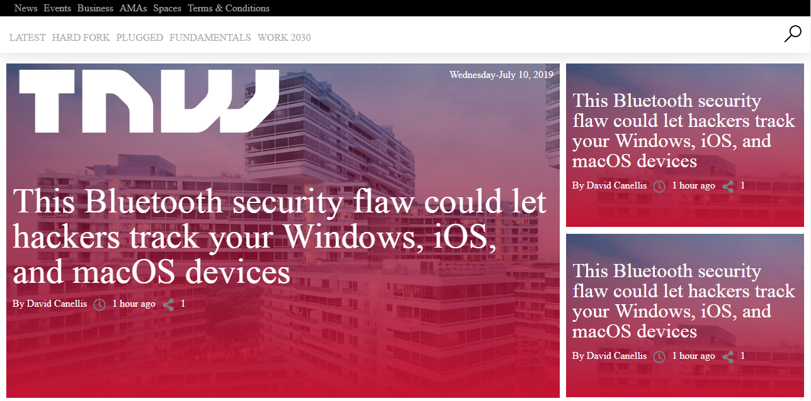

# RESPONSIVE DESIGN

The main objective is to build a responsive website. We’ll be cloning The Next Web, a tech-focused magazine which uses media queries to gracefully degrade their site as the window size is reduced.

[The Next Web ](https://thenextweb.com)

## Screenshot

 

## Technologies
 * HTML5
 * JAVASCRIPT
 * CSS Grid
 

## Live Demo

[Live Demo Link](https://raw.githack.com/kobiyoyo/Responsive-Design-/master/index.html)

## Authors

👤 **Adama Chubiyojo Desmond**

-  [Github](https://github.com/kobiyoyo)
-  [Twitter](https://twitter.com/_kobiyoyo)
-  [Linkedin](https://www.linkedin.com/in/chubiyojo-adama/)
-  [Email](mailto:adamachubi@gmail.com)

👤 **Danilo Zagarcanin**

- [Github](https://github.com/danilozag1992)
- [Twitter](https://twitter.com/danilo96061514)
- [Linkedin](https://www.linkedin.com/in/danilo-zagarcanin-88169b185/)
- [Email](mailto:danilozagarcanin@gmail.com)

## 🤝 Contributing

Contributions, issues and feature requests are welcome!

Feel free to check the [issues page](issues/).

## Usage

> Clone the repository to your local machine

```sh
$ git clone https://github.com/danilozag1992/Responsive-Design-.git
```
> cd into the directory

```sh
$ cd Responsive-Design
```
## Show your support

Give a ⭐️ if you like this project!

## Acknowledgments

- Hat tip to anyone whose code was used
- Inspiration
- etc

## 📝 License

This project is [MIT](lic.url) licensed.
